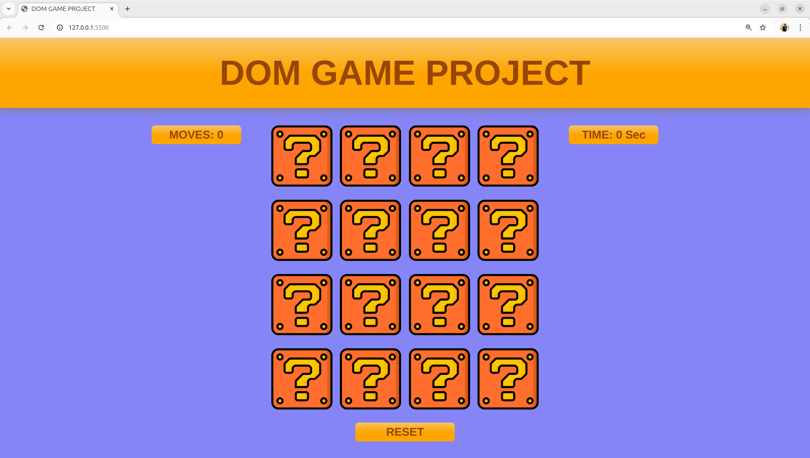

# DOM Game Project - Card Matching Game

## [Visit the project](https://roaring-puffpuff-f1bdab.netlify.app/)

This is a web-based card matching game where players have to find pairs of identical cards. The game includes a move counter to track the number of moves taken and a timer to measure how long it takes to find all the matching pairs.

## Features

- **Card Matching**: The game contains a set of cards that need to be flipped to find matching pairs.
- **Move Counter**: Tracks the number of moves made by the player.
- **Timer**: Tracks the total time taken by the player to find all matching pairs.
- **Responsive Design**: The game is designed to work well on both desktop and mobile devices.

## Technologies Used

- **HTML**: Used for structuring the content of the game.
- **CSS**: Used for styling the game interface and animations.
- **JavaScript**: Used for the game logic, such as card flipping, matching, and tracking moves and time.

## How to Play

1. The game consists of a set of cards placed face down on the game board.
2. Click on any card to flip it over and reveal the face.
3. Find the matching pairs by flipping two cards at a time.
4. If the two cards match, they remain face-up.
5. If the two cards do not match, they will flip back over after a short delay.
6. The game ends when all pairs have been matched.

## Game Features

- **Move Counter**: Every time a pair of cards is flipped, the move counter is incremented.
- **Timer**: The timer starts as soon as the game begins and tracks the total time taken to complete the game.
- **Game Reset**: A reset button allows you to start a new game after completing one.
